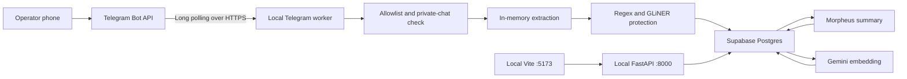

# FinBrain Telegram Capture Bot — Local-First Implementation Plan

Status: Approved planning baseline  
Target: Hackathon prototype running locally on the demonstration laptop  
Last updated: 2026-08-13  
Primary database: Supabase Postgres with pgvector  
Reasoning provider: Morpheus `deepseek-v4-flash`  
Embedding provider: Gemini `gemini-embedding-001`

## 1. Purpose

Implement an authenticated Telegram bot that lets an approved FinBrain operator remotely capture:

- customer messages;
- transaction notes;
- pasted or forwarded email text;
- text extracted locally from supported documents.

The bot must reuse FinBrain's existing protected-ingestion boundary. Raw source content may exist in Telegram and transient process memory, but the FinBrain database, application logs, audit events, model prompts, and embeddings must contain only protected content.

This plan is written for later execution against the current repository. It is intentionally local-first so that the hackathon demonstration does not depend on deploying the frontend, FastAPI backend, GLiNER, or bot worker to a public hosting platform.

## 2. Decisions already made

The following decisions are part of the implementation baseline and should not be reopened unless a technical blocker is found:

1. The bot will use Telegram Bot API long polling for the hackathon.
2. The bot worker, FastAPI backend, and Vite frontend will run as three separate local processes.
3. The bot worker will call FinBrain's Python service layer directly instead of calling the local HTTP `/ingestion` route.
4. Supabase, Morpheus, Gemini, and Telegram remain remote dependencies.
5. Telegram access will be limited to private chats and explicitly allowlisted numeric Telegram user IDs.
6. Telegram users will be mapped to a fixed FinBrain role by server-controlled configuration. The user cannot select or submit their own role.
7. The first version will support capture and status. It will not return detokenized customer data through Telegram.
8. Raw drafts and downloaded attachment bytes will be held in memory only and discarded after confirmation, cancellation, expiration, or error.
9. Text-based PDF and DOCX extraction are in scope. OCR for scanned images and scanned PDFs is deferred.
10. Transaction notes are customer-intelligence records, not an accounting ledger. Amounts use reversible, role-gated band-aware tokens; Telegram acknowledgements expose only the protected token.
11. The implementation remains single-tenant for the hackathon.
12. The existing web query, role-gated detokenization, and disclosure audit flow remain the authoritative way to retrieve sensitive values.

## 3. Success criteria

The implementation is successful when all of the following are true:

- An unauthorized Telegram account cannot ingest or query records.
- An authorized operator can capture each supported record type from a private Telegram chat.
- The bot displays a protected preview before confirmation.
- Confirmation creates exactly one canonical record even if Telegram delivers an update or callback more than once.
- Raw PII does not appear in Supabase protected-content rows, audit rows, application logs, exception messages, model requests, or embeddings.
- Morpheus receives only protected text for summarization.
- Gemini receives only protected text and protected summaries for embeddings.
- A failed enrichment leaves the protected source record recoverable with `failed_enrichment` status.
- A Telegram-created record becomes visible in the local FinBrain frontend without restarting the app.
- Existing web queries, detokenization permissions, and disclosure auditing continue to work.
- The entire demonstration can be started with one PowerShell command.
- The demonstration can recover cleanly after the bot process is restarted.

## 4. Prototype scope

### 4.1 Required for the hackathon

- Telegram BotFather bot token configuration.
- Private-chat-only long polling.
- Numeric user-ID allowlist and fixed role mapping.
- `/start`, `/capture`, `/status`, `/cancel`, `/privacy`, `/help`, and `/whoami` commands.
- Inline record-type selection.
- Plain text and forwarded text capture.
- Protected preview with confirm/cancel buttons.
- Direct canonical ingestion into Supabase.
- Telegram provenance stored in protected metadata.
- Idempotent update and message handling.
- Generic, privacy-safe failure messages.
- Bot heartbeat and recent Telegram ingestion status in the frontend.
- Local startup, shutdown, and connectivity-check scripts.
- Automated unit, integration, and privacy-boundary tests.

### 4.2 Required if time permits before judging

- TXT, Markdown, CSV, EML, text-based PDF, and DOCX extraction.
- Background enrichment after immediate protected persistence.
- Automatic retry of `protected` and `failed_enrichment` rows.
- Optional removal of the incoming Telegram message after successful ingestion.
- Telegram-specific ingestion audit events.
- A prepared demonstration PDF and EML fixture.

### 4.3 Explicitly deferred

- OCR for images or scanned PDFs.
- Voice note transcription.
- Group and channel operation.
- Telegram Business account access.
- Live Gmail or Outlook inbox connectors.
- Bank statement interpretation beyond text/CSV capture.
- Telegram commands that detokenize customer information.
- Telegram Mini Apps.
- Multi-tenant operator and tenant isolation.
- Redis, Celery, or a durable distributed job queue.
- Webhook hosting.
- Production authentication for the existing frontend.
- Automated retention deletion from Telegram's infrastructure.

## 5. Current FinBrain flow to preserve

The bot is an input adapter. It must not create a parallel privacy or AI pipeline.

```text
Telegram text/document
  -> local extraction in memory
  -> CanonicalIngestionRecord
  -> deterministic fingerprint
  -> regex + GLiNER detection
  -> deterministic tokens + encrypted token vault
  -> protected source persistence
  -> Morpheus protected structured summary
  -> Gemini 768-dimensional protected embedding
  -> Supabase pgvector retrieval
  -> web query reasoning over protected context
  -> role-gated detokenization
  -> hash-chained disclosure audit
```

The existing `CanonicalIngestionRecord` remains the source-neutral boundary. Telegram-specific code is responsible only for authentication, user interaction, text extraction, provenance mapping, and calling the shared ingestion service.

## 6. Local architecture



### 6.1 Local processes

| Process | Command responsibility | Port |
|---|---|---:|
| FastAPI | Query, ingestion API, audit API, Telegram history/status API | 8000 |
| Vite | Hackathon user interface | 5173 |
| Telegram worker | Long polling, drafts, extraction, direct ingestion | None |

The bot worker needs outbound HTTPS only. It does not need a public IP, inbound firewall rule, domain, TLS certificate, tunnel, or webhook.

### 6.2 Remote dependencies

The local demonstration still requires working internet connectivity for:

- Telegram Bot API;
- Supabase Postgres;
- Morpheus API;
- Gemini API;
- first-time model downloads, unless cached before the event.

The GLiNER and transformer model files must be downloaded and warmed before judging.

## 7. Telegram bot setup

### 7.1 BotFather preparation

The operator will create a bot through the verified `@BotFather` account:

1. Run `/newbot`.
2. Choose a display name such as `FinBrain Capture`.
3. Choose a unique username ending in `bot`.
4. Copy the generated token directly into the ignored local `backend/.env`.
5. Disable group joining in the bot settings.
6. Keep group privacy enabled.
7. Add a short description, about text, and profile image.
8. Configure the supported commands.

Suggested BotFather commands:

```text
start - Connect to FinBrain
capture - Capture a protected business record
status - Show recent submission status
cancel - Cancel the active capture
privacy - Explain data handling
help - Show available commands
whoami - Show your Telegram setup ID
```

The token must never be committed, printed by check scripts, included in screenshots, or embedded in URLs stored in logs.

### 7.2 Getting the operator user ID

Implement `/whoami` so that any user can receive only their own numeric Telegram user ID. All other commands remain blocked until that ID is added to the local role map.

After obtaining the ID:

1. Add it to `TELEGRAM_OPERATOR_ROLES` in `backend/.env`.
2. Restart the bot worker.
3. Verify `/start` reports authorized access.

Do not use a Telegram username or display name for authorization because either can change or be imitated.

## 8. Configuration contract

Add the following fields to `backend/app/config.py` and `backend/.env.example`. Secret values must remain blank in the example file.

```dotenv
TELEGRAM_BOT_TOKEN=
TELEGRAM_MODE=polling
TELEGRAM_OPERATOR_ROLES=123456789:owner_director
TELEGRAM_ALLOWED_CHAT_TYPES=private
TELEGRAM_DRAFT_TTL_SECONDS=600
TELEGRAM_MAX_FILE_BYTES=10000000
TELEGRAM_MAX_EXTRACTED_CHARS=100000
TELEGRAM_MAX_PDF_PAGES=50
TELEGRAM_MAX_DOCX_MEMBERS=1000
TELEGRAM_MAX_DOCX_UNCOMPRESSED_BYTES=25000000
TELEGRAM_DELETE_SOURCE_AFTER_INGEST=false
TELEGRAM_STATUS_LIMIT=5
TELEGRAM_HEARTBEAT_SECONDS=30
TELEGRAM_PREVIEW_CHARS=1200
TELEGRAM_ENRICHMENT_CONCURRENCY=1
```

Add typed settings and validators for:

- positive limits;
- recognized Telegram modes;
- recognized FinBrain roles;
- duplicate user IDs;
- malformed role mapping entries;
- a missing token when the runner is started;
- an empty operator list in non-bootstrap mode.

Provide a `telegram_operator_role_map` property returning `dict[int, UserRole]`.

The standard FinBrain variables remain required:

```dotenv
DATABASE_URL=
TOKEN_ROOT_SECRET=
MORPHEUS_API_KEY=
MORPHEUS_BASE_URL=https://api.mor.org/api/v1
MORPHEUS_MODEL=deepseek-v4-flash
GEMINI_API_KEY=
GEMINI_EMBEDDING_MODEL=gemini-embedding-001
ENABLE_GLINER=true
GLINER_MODEL_NAME=urchade/gliner_multi_pii-v1
GLINER_DEVICE=cpu
ALLOW_OFFLINE_DEMO=false
```

For the hackathon, `ALLOW_OFFLINE_DEMO=false` is preferred so the UI does not silently represent local fallback output as successful hosted enrichment. Protected persistence must still survive enrichment failure.

## 9. Dependency and packaging changes

Update `backend/pyproject.toml` with pinned compatible dependency ranges:

```toml
"python-telegram-bot>=22.8,<23"
"pypdf>=6,<7"
"python-docx>=1.2,<2"
"beautifulsoup4>=4.13,<5"
```

Do not add an OCR dependency during the first implementation.

Fix the current editable-install package discovery problem by explicitly including the intended top-level packages. The exact setuptools configuration should include `app`, `seed`, and `scripts`, or the repository should be moved to a `src` layout. The minimal hackathon change is explicit package discovery.

Regenerate the dependency lock file if the chosen package workflow uses one. Verify installation into a clean Python 3.12 or 3.13 virtual environment.

## 10. Repository changes

### 10.1 New backend modules

```text
backend/app/integrations/__init__.py
backend/app/integrations/telegram/__init__.py
backend/app/integrations/telegram/adapter.py
backend/app/integrations/telegram/auth.py
backend/app/integrations/telegram/bot.py
backend/app/integrations/telegram/drafts.py
backend/app/integrations/telegram/extractors.py
backend/app/integrations/telegram/handlers.py
backend/app/integrations/telegram/keyboards.py
backend/app/integrations/telegram/logging.py
backend/app/integrations/telegram/receipts.py
backend/app/integrations/telegram/runner.py
backend/app/integrations/telegram/service.py
backend/app/integrations/telegram/types.py
```

### 10.2 New routes and scripts

```text
backend/app/routes/integrations.py
backend/scripts/check_telegram.py
backend/scripts/prewarm_detector.py
backend/scripts/retry_enrichment.py
scripts/run_demo.ps1
scripts/stop_demo.ps1
scripts/check_demo.ps1
```

### 10.3 New tests and fixtures

```text
backend/tests/test_telegram_adapter.py
backend/tests/test_telegram_auth.py
backend/tests/test_telegram_drafts.py
backend/tests/test_telegram_extractors.py
backend/tests/test_telegram_handlers.py
backend/tests/test_telegram_idempotency.py
backend/tests/test_telegram_privacy.py
backend/tests/test_telegram_routes.py
backend/tests/fixtures/sample.txt
backend/tests/fixtures/sample.csv
backend/tests/fixtures/sample.eml
backend/tests/fixtures/sample.pdf
backend/tests/fixtures/sample.docx
```

All fixtures must contain fictitious data created for testing. They must not contain actual customer data.

## 11. Ingestion service refactor

The current `ingest_canonical_record()` protects, persists, summarizes, and embeds in one call. Telegram should acknowledge safe persistence before waiting for enrichment.

Refactor the service into three public operations while retaining a compatibility wrapper:

```python
protect_canonical_record(db, record, *, refresh=False) -> IngestionResult
enrich_protected_record(db, source_record_id) -> IngestionResult
retry_pending_enrichment(db, *, limit=...) -> list[IngestionResult]
```

Keep:

```python
ingest_canonical_record(db, record, *, refresh=False, enrich=True)
```

as a wrapper so current seed, HTTP route, and tests do not need to change simultaneously.

### 11.1 Protect stage

The protect stage must:

1. Validate the opaque source ID.
2. Compute the keyed content fingerprint.
3. Resolve idempotent existing records.
4. Detect and tokenize source text.
5. Detect and tokenize metadata values.
6. Persist encrypted vault entries.
7. Persist only protected content and protected metadata.
8. Set status to `protected`.
9. Commit before returning.
10. Never call Morpheus or Gemini.

### 11.2 Enrichment stage

The enrichment stage must:

1. Load the already protected record by opaque ID.
2. Refuse to process recognizable residual PII.
3. Summarize protected text through Morpheus.
4. Validate summary tokens and structured output.
5. Embed protected text and protected summary through Gemini.
6. Persist summary, structured summary, 768-dimensional vector, and provider mode.
7. Mark the row `ready`.
8. On any exception, rollback and mark `failed_enrichment` with a generic stage code.
9. Never persist exception text or provider response bodies.

### 11.3 Bot usage

After confirmation, the bot should:

1. Call `protect_canonical_record()` using a fresh database session.
2. Reply that the record is safely protected.
3. Schedule `enrich_protected_record()` using a bounded background task.
4. Edit or follow up on the Telegram confirmation when enrichment completes.

Use an `asyncio.Semaphore` set by `TELEGRAM_ENRICHMENT_CONCURRENCY` to prevent a burst of model work from overwhelming the demonstration laptop.

Every database operation running in a background thread or task must create and close its own `SessionLocal` session.

## 12. Detector readiness and fail-closed behavior

The existing detector falls back to regex-only operation when GLiNER cannot load. That is convenient for local development but weakens the privacy claim for names, organizations, and addresses.

Add detector lifecycle functions:

```python
warm_detector() -> DetectorStatus
get_detector_status() -> DetectorStatus
```

`DetectorStatus` should expose only safe operational values:

```text
configured
loaded
device
model_name
failure_code
```

It must not expose exception text that may include filesystem paths or credentials.

The Telegram runner must prewarm GLiNER at startup. If `ENABLE_GLINER=true` and the model cannot load, the runner must:

- report an unhealthy heartbeat;
- accept `/help`, `/privacy`, and `/whoami`;
- refuse new record capture with a safe temporary-unavailable message;
- never silently send regex-only protected Telegram content to external AI services.

The current manual HTTP route can retain its existing behavior until a broader policy decision is made, but the Telegram boundary must fail closed.

## 13. Telegram authorization

Implement authorization in `auth.py`.

### 13.1 Required checks

For every message and callback:

1. An effective user must be present.
2. An effective chat must be present.
3. Chat type must be `private`.
4. User ID must exist in the configured role map, except for `/whoami`, `/help`, and `/privacy`.
5. Callback user ID and chat ID must match the draft owner.
6. The resolved role must come only from server configuration.

### 13.2 Denied behavior

Unauthorized users receive a generic message:

> This FinBrain bot is restricted to approved operators.

Do not reveal the allowlist, roles, organization name, record counts, health status, or configuration.

Record a privacy-safe denial event using an HMAC-derived actor reference.

### 13.3 Actor reference

Derive an audit-safe operator reference:

```text
HMAC(TOKEN_ROOT_SECRET, "telegram-actor:" + telegram_user_id)
```

Persist only a truncated, collision-resistant digest such as 32 hexadecimal characters. Do not persist usernames or display names.

## 14. Bot conversation model

### 14.1 States

```text
IDLE
  -> SELECTING_TYPE
  -> WAITING_FOR_CONTENT
  -> REVIEWING_PROTECTED_PREVIEW
  -> PROTECTING
  -> ENRICHING
  -> COMPLETE
```

`/cancel` is valid from every non-idle state and returns to `IDLE`.

### 14.2 Commands

#### `/start`

Authorized response:

- identify FinBrain Capture;
- state the operator's fixed FinBrain role;
- show a capture button;
- show the Telegram privacy disclosure;
- never show API configuration.

Unauthorized response uses the restricted message.

#### `/capture`

Clear any expired draft and display the record-type keyboard.

#### `/status`

Return the operator's most recent Telegram-origin records, limited by configuration. Show only:

- short opaque reference;
- record type;
- protected/ready/failed status;
- protected priority/category when ready;
- relative or formatted timestamp.

Do not detokenize the summary or source.

#### `/cancel`

Remove the draft from memory, invalidate callback nonces, and confirm cancellation.

#### `/privacy`

Explain:

- Telegram transports and may retain the original message;
- FinBrain does not persist the raw content in its own database;
- only protected text is sent to Morpheus and Gemini;
- the operator must have authority to submit the information;
- message deletion is optional and not a guarantee of deletion from all systems.

#### `/help`

List commands and supported input types. Do not expose internal architecture details to unauthorized users.

#### `/whoami`

Return only the requesting user's numeric Telegram ID and a reminder that it is used for setup. Do not return other profile or chat information.

### 14.3 Record-type keyboard

Use inline buttons:

```text
Customer message
Transaction note
Email
Document text
Cancel
```

Map these to canonical record types:

```text
customer_message
transaction_note
email
document_text
```

### 14.4 Content handling

Accepted content:

- normal text;
- forwarded text;
- document with an allowed type;
- document caption plus extracted text.

Unsupported photos, voice messages, videos, stickers, contacts, and locations receive a concise unsupported-input response.

### 14.5 Protected review

After local extraction:

1. Generate the opaque source record ID.
2. Run detection and tokenization to produce an in-memory protected preview.
3. Store the raw canonical record only in the expiring draft cache.
4. Show record type, character count, source kind, and truncated protected preview.
5. Present signed confirm/cancel/change-type callbacks.

Never echo the raw content back from the bot.

### 14.6 Callback security

Callback data is visible to the Telegram client and has a strict size limit. It must contain only:

- an action identifier;
- a random draft nonce;
- a short HMAC signature.

It must not contain raw text, record summaries, customer identifiers, filenames, roles, chat IDs, or database IDs.

Validate the callback signature with `secrets.compare_digest()` and require the callback to match the in-memory draft owner.

## 15. Draft storage

Implement an in-memory TTL store in `drafts.py` without Redis.

### 15.1 Draft content

```text
draft_nonce
telegram_user_id
telegram_chat_id
telegram_message_id
record_type
canonical_record
protected_preview
source_kind
created_monotonic
expires_monotonic
```

The canonical record inside a draft contains raw extracted text. It must never be serialized, pickled, logged, written to disk, or placed in a database.

### 15.2 Draft rules

- One active draft per authorized Telegram user.
- Default TTL: 10 minutes.
- Creating a new capture replaces the previous draft after explicit notice.
- Expired drafts behave as missing and ask the user to resend.
- Confirmation atomically removes the draft before starting persistence, while retaining a local function reference for the operation.
- Cancellation removes the draft immediately.
- Shutdown clears the in-memory store.

Python cannot guarantee immediate memory zeroization. The prototype guarantee is no intentional raw persistence, bounded lifetime, and prompt removal of references.

## 16. Telegram-to-canonical adapter

Implement all normalization in `adapter.py`.

### 16.1 Opaque record ID

Generate:

```text
telegram:<32-character-lowercase-hex-hmac>
```

HMAC input should include stable delivery identifiers:

```text
chat_id | message_id | file_unique_id-or-text | selected-record-type
```

Use `TOKEN_ROOT_SECRET` as the HMAC root or derive a dedicated subkey from it. Never include the bot token in the derivation.

The result satisfies the existing canonical ID pattern and makes duplicate delivery idempotent without storing Telegram IDs in plaintext.

### 16.2 Canonical mapping

```text
source_record_id = generated opaque Telegram ID
source_system    = telegram
record_type      = selected canonical type
text             = extracted source text
occurred_at      = Telegram message timestamp
metadata         = fixed-key provenance values
```

Suggested fixed metadata keys:

```text
channel=telegram_private
input_kind=text|forwarded_text|txt|csv|eml|pdf|docx
forwarded=true|false
mime_type=<received MIME type>
filename=<original filename if present>
page_count=<integer string when known>
telegram_caption=<caption if present>
```

Metadata values pass through the existing protection boundary. Do not add dynamic keys derived from documents or user text.

Do not persist `forward_origin` names, Telegram usernames, display names, or chat titles. A boolean forwarded flag is sufficient for the prototype.

### 16.3 Email mapping

For pasted email text, use the submitted text as-is.

For EML files, build normalized text containing available fields:

```text
Subject: ...
From: ...
To: ...
Date: ...

<plain body>
```

These header values intentionally enter the ordinary protection boundary. Do not store them separately as unprotected metadata.

## 17. Document extraction

All extraction must occur locally before the canonical ingestion service is called.

### 17.1 Supported types

| Input | MIME/extension | Extractor |
|---|---|---|
| Plain text | `.txt`, `.md` | bounded UTF decoder |
| CSV | `.csv` | bounded UTF decoder; no formula execution |
| Email | `.eml` | Python standard-library email parser |
| PDF | `.pdf` | `pypdf` |
| Word | `.docx` | `python-docx` after ZIP safety checks |

### 17.2 Download rules

Before downloading:

- require a Telegram document object;
- require reported size at or below `TELEGRAM_MAX_FILE_BYTES`;
- require an allowlisted extension and compatible MIME type;
- preserve the original filename only as a metadata value that will be protected;
- never place the bot token or file URL in logs.

Download into `BytesIO`. If a library requires a path, use a uniquely created temporary file, verify it is within the process temporary directory, and delete it in `finally`.

### 17.3 General text normalization

After extraction:

- remove NUL characters;
- normalize newlines to `\n`;
- replace invalid Unicode sequences safely;
- collapse excessive blank lines;
- preserve meaningful paragraph and table boundaries;
- reject empty output;
- reject output over `TELEGRAM_MAX_EXTRACTED_CHARS` rather than silently truncating business content;
- do not execute formulas, macros, links, embedded objects, JavaScript, or remote resources.

### 17.4 TXT, Markdown, and CSV

Attempt UTF-8 first. Allow UTF-8 BOM. A conservative fallback such as Windows-1252 may be used only when decoding fails. Record the chosen format as an internal metric, not user-controlled metadata.

CSV is treated as text. Do not evaluate cells beginning with `=`, `+`, `-`, or `@`.

### 17.5 EML

- Parse MIME structure using the standard library.
- Prefer `text/plain` parts.
- If only HTML is present, remove scripts, styles, forms, tracking elements, and convert visible text with BeautifulSoup.
- Ignore attachments inside the EML for the first version.
- Bound the number and total size of MIME parts.
- Never fetch remote images or URLs.

### 17.6 PDF

- Verify the PDF signature.
- Reject encrypted/password-protected PDFs.
- Reject documents over the configured page limit.
- Extract text page-by-page into memory.
- Include simple page separators.
- Reject PDFs producing no meaningful text and explain that scanned-document OCR is not yet supported.
- Never render or execute embedded content.

### 17.7 DOCX

DOCX is a ZIP container. Before opening with `python-docx`:

- verify the ZIP signature;
- cap member count;
- cap total uncompressed size;
- reject path traversal names;
- reject macro-enabled formats;
- reject external template or relationship retrieval;
- extract paragraphs and table cells only;
- ignore embedded files and images.

### 17.8 Extractor response

Return a typed result:

```text
text
input_kind
mime_type
filename
page_count
character_count
```

Extractor errors must use stable safe codes such as:

```text
unsupported_file_type
file_too_large
invalid_file_signature
encrypted_pdf
pdf_page_limit
no_extractable_text
document_expansion_limit
extracted_text_too_large
malformed_document
```

Do not return parser exception text to Telegram or store it in the database.

## 18. Idempotency and update receipts

The existing canonical source ID uniqueness is the final ingestion idempotency control. Add a Telegram update receipt table for update-level observability and early duplicate rejection.

### 18.1 `telegram_update_receipts`

Suggested columns:

```text
update_id              bigint primary key
message_ref_hash       varchar unique null
actor_ref              varchar not null
source_record_id       varchar null
update_kind            varchar not null
status                 varchar not null
failure_code           varchar null
created_at             timestamptz not null
updated_at             timestamptz not null
```

Allowed status values:

```text
received
ignored
drafted
confirmed
protected
ready
failed
cancelled
```

The table must not contain raw update JSON, text, captions, filenames, user names, chat IDs, or callback payloads.

### 18.2 Processing rules

- Insert the receipt before performing a side effect when practical.
- Treat duplicate `update_id` insert conflicts as already handled.
- Use the deterministic canonical source ID as the second line of defense.
- Confirmation callbacks must be safe to retry.
- If the row already exists as `ready`, return the existing status instead of re-enriching.
- If it exists as `protected` or `failed_enrichment`, permit a controlled retry.

## 19. Telegram ingestion audit

The current hash-chained audit log records detokenization decisions. Preserve it for disclosure auditing.

Add a separate privacy-safe ingestion event stream or extend the audit model through a versioned migration. A separate table is lower risk for the hackathon.

Suggested events:

```text
telegram_operator_denied
telegram_capture_started
telegram_attachment_rejected
telegram_draft_created
telegram_draft_cancelled
telegram_record_confirmed
telegram_record_protected
telegram_enrichment_ready
telegram_enrichment_failed
telegram_source_delete_requested
telegram_source_delete_failed
```

Suggested columns:

```text
id
event_type
actor_ref
source_record_id
outcome
detail_code
ts
prev_hash
event_hash
```

Do not store human-written descriptions. Use fixed event and detail codes. Hash the canonical event payload as the existing audit service does.

For concurrent writes, lock or serialize event-chain appends so two processes cannot create the same predecessor relationship. Low hackathon volume does not remove the need for deterministic tests around this behavior.

## 20. Integration heartbeat

Add a small `integration_status` table or equivalent status row:

```text
integration_key=telegram
status=starting|healthy|degraded|stopped
mode=polling
last_heartbeat_at
last_update_at
failure_code
```

The bot worker should:

- set `starting` before detector warmup;
- set `healthy` after Telegram `getMe`, detector readiness, and database connectivity succeed;
- update the heartbeat at the configured interval;
- set `degraded` after repeated polling or enrichment infrastructure failures;
- attempt to set `stopped` during graceful shutdown.

The frontend considers the bot online when a healthy heartbeat is newer than 90 seconds.

Never store the bot username, token, operator IDs, provider keys, or raw exception text in this table.

## 21. Bot runner lifecycle

Implement `runner.py` as the executable entry point.

Startup order:

1. Load and validate settings.
2. Configure redacted structured logging.
3. Verify database connectivity.
4. Verify Telegram token using `getMe`.
5. Prewarm GLiNER.
6. Register BotFather-equivalent command definitions through the API.
7. Start the heartbeat task.
8. Scan a bounded number of protected/failed records for enrichment retry.
9. Start long polling with only required update types.

Required update types:

```text
message
callback_query
```

Do not request channel, membership, reaction, inline-query, or business-account updates.

Shutdown order:

1. Stop accepting new updates.
2. Stop polling.
3. Allow currently committing protect operations to finish within a timeout.
4. Cancel non-critical enrichment tasks safely.
5. Clear drafts.
6. Stop heartbeat.
7. Mark integration stopped if possible.
8. Close HTTP clients and database resources.

## 22. Logging and secret protection

Use structured, privacy-safe logs containing only:

- timestamp;
- log level;
- component;
- safe event code;
- opaque source record ID or short reference;
- HMAC actor reference;
- duration;
- outcome;
- generic failure code.

Explicitly prohibit logging:

- Telegram `Update`, `Message`, `User`, or `Document` representations;
- message text and captions;
- extracted document text;
- filenames;
- Telegram user/chat/message IDs;
- callback data;
- Telegram file paths or download URLs;
- model prompts and model responses;
- database URLs;
- API keys and bot tokens;
- decrypted token vault values;
- exception request/response bodies.

Set noisy HTTP client and Telegram library loggers to warning or error. Add a redaction filter for common credential patterns and Telegram `/bot<TOKEN>/` URL forms as defense in depth.

Error handlers must log only safe exception class/category mappings, never `str(exception)` by default.

## 23. Telegram responses

Responses should be concise and useful on a phone.

### 23.1 Protected preview

```text
Ready to protect

Type: Customer message
Input: Forwarded text
Characters: 428

Protected preview:
PERSON_a1b2c3d4e5 asked us to call PHONE_...

The original text will not be stored by FinBrain.
```

Buttons:

```text
Confirm and ingest
Change type
Cancel
```

### 23.2 Protected acknowledgement

```text
Record protected

Reference: TG-84F2A1
Status: Enriching

Only protected text has been stored and sent for AI enrichment.
```

### 23.3 Completion

```text
Record ready

Reference: TG-84F2A1
Category: payment_attention
Priority: high
Action required: yes
```

The summary must remain protected. Do not detokenize it for Telegram.

### 23.4 Safe failure

```text
Record protected, enrichment pending

Reference: TG-84F2A1
Your protected record is safe. FinBrain will retry enrichment later.
```

Do not disclose provider names, HTTP status codes, database errors, stack traces, or retry internals to Telegram users.

## 24. Optional Telegram source deletion

Default:

```dotenv
TELEGRAM_DELETE_SOURCE_AFTER_INGEST=false
```

If enabled, request deletion only after protected persistence succeeds, not after enrichment. Deletion failure must not roll back the protected record.

The confirmation message must clearly state whether source deletion was requested. Documentation must explain that deleting a Telegram message is not a guarantee that no copies or service-side records remain.

For the hackathon, keep deletion disabled unless the demonstration explicitly covers it and it has been tested on the target private chat.

## 25. Backend API additions for the frontend

Add protected read-only endpoints.

### 25.1 `GET /integrations/telegram/status`

Example response:

```json
{
  "configured": true,
  "mode": "polling",
  "status": "healthy",
  "detector_ready": true,
  "last_heartbeat_at": "2026-08-13T12:00:00Z",
  "last_update_at": "2026-08-13T11:59:40Z"
}
```

Do not expose secrets, bot username, operator count, user IDs, or failure internals in the public prototype endpoint.

### 25.2 `GET /ingestion-records`

Support safe filters:

```text
source_system=telegram
processing_status=ready|protected|failed_enrichment
limit=1..100
```

Return only:

```text
source_record_id
source_system
record_type
protected content excerpt
protected summary
structured category
priority
action_required
processing_status
enrichment_mode
occurred_at
created_at
updated_at
protected safe_metadata
```

Never detokenize values in this listing endpoint.

The current application lacks real authentication. This endpoint is suitable only for the local single-user prototype and must be authenticated before hosted or multi-user use.

## 26. Frontend changes

### 26.1 Ingestion screen

Extend the current screen rather than introducing a large new navigation hierarchy.

Add a Telegram integration card showing:

- Online, degraded, offline, or not configured;
- polling mode;
- detector ready/not ready;
- last heartbeat;
- last Telegram record time;
- a link to open the bot when a non-secret bot username is intentionally configured for display.

### 26.2 Protected ingestion history

Add a recent-record list filtered to Telegram. Poll the protected list endpoint every three seconds while the screen is visible. Avoid SSE or WebSockets for the hackathon.

Each row should show:

- short reference;
- record type;
- protected/ready/failed status;
- protected summary;
- category and priority;
- occurred time;
- Telegram provenance badge.

Add empty, loading, stale, and error states.

### 26.3 Copy corrections

Replace provider-specific copy such as:

```text
Gemini and Supabase receive
```

with:

```text
AI services and Supabase receive only protected content
```

Where additional detail is appropriate:

- Morpheus produces the protected summary.
- Gemini produces the protected embedding.

### 26.4 Accessibility and mobile behavior

- Status cannot rely on color alone.
- Polling errors must use an accessible live region without repeatedly interrupting screen readers.
- Long protected tokens must wrap.
- History must remain usable at narrow widths.
- Buttons must have visible focus states.

## 27. Database migrations

Create a new timestamped Supabase migration rather than relying on `Base.metadata.create_all()` for deployed schema evolution.

The migration should add:

- `telegram_update_receipts`;
- `telegram_ingestion_events` if included in the implementation phase;
- `integration_status`;
- required indexes;
- constraints for fixed status and event values where practical;
- timestamps and safe uniqueness constraints.

Add corresponding SQLAlchemy models with portable SQLite/Postgres types so unit tests remain fast.

Suggested indexes:

```text
telegram_update_receipts(source_record_id)
telegram_update_receipts(actor_ref, created_at desc)
telegram_update_receipts(status, updated_at desc)
telegram_ingestion_events(source_record_id, ts desc)
integration_status(integration_key unique)
tokenized_content(source_system, created_at desc)
```

Apply migrations to a separate test Supabase project first if available. Verify the existing initial and unified-ingestion migrations are already present before applying the Telegram migration.

## 28. Testing strategy

No automated test may contact Telegram, Supabase, Morpheus, Gemini, or Hugging Face unless it is explicitly marked as an opt-in connectivity test.

### 28.1 Unit tests

#### Authorization

- Private allowlisted user is accepted.
- Private non-allowlisted user is denied.
- Group and channel chats are denied.
- Username changes do not affect authorization.
- Role is taken only from configuration.
- Malformed role mappings fail startup.
- `/whoami` returns only the caller's ID.

#### Adapter

- Each selected type maps correctly.
- Source IDs are valid, deterministic, and opaque.
- Same message produces the same source ID.
- Different messages produce different IDs.
- No raw Telegram identifiers appear in source IDs or metadata.
- Timestamps retain timezone meaning.
- Dynamic metadata keys are rejected.

#### Drafts

- Only one active draft exists per user.
- Expiration works with a fake monotonic clock.
- Cancel removes a draft.
- Confirmation removes a draft atomically.
- A callback from another user is rejected.
- A forged signature is rejected.
- A stale nonce is rejected.

#### Extractors

- Valid TXT, CSV, EML, PDF, and DOCX fixtures extract expected text.
- Invalid signatures are rejected.
- Oversized files are rejected before download when possible.
- Encrypted PDFs are rejected.
- Page limits are enforced.
- Scanned/no-text PDFs return `no_extractable_text`.
- DOCX ZIP traversal and expansion limits are enforced.
- HTML email scripts and styles are removed.
- EML attachments are ignored.
- Extracted text limits are enforced.
- Parser exception text never reaches the public error.

#### Ingestion refactor

- Protect stage makes no external model calls.
- Protect stage commits before returning.
- Enrichment operates only on protected text.
- Enrichment failure preserves the protected row.
- Retry changes a recoverable row to ready.
- Compatibility wrapper preserves current behavior.

### 28.2 Handler tests

Construct Telegram update objects from static fictitious dictionaries.

Test:

- command routing;
- record-type buttons;
- unsupported messages;
- protected preview;
- confirmation;
- cancellation;
- duplicate message update;
- duplicate callback update;
- expired draft;
- detector unavailable;
- database unavailable;
- attachment download failure;
- source deletion success/failure;
- safe bot responses.

### 28.3 Privacy invariant tests

Use a unique fictitious sentinel set containing:

- person name;
- Malaysian phone number;
- email address;
- NRIC-format value;
- bank account number;
- address;
- company name;
- RM amount.

After simulated ingestion, assert that raw sentinel values are absent from:

- `tokenized_content` source and summary fields;
- protected metadata;
- update receipt rows;
- ingestion event rows;
- captured logs;
- mocked Morpheus request payloads;
- mocked Gemini embedding payloads;
- bot acknowledgement messages;
- exception messages.

Assert that authorized raw values exist only in encrypted vault entries and cannot be read as plaintext bytes.

### 28.4 Integration tests

Use SQLite and mocked AI/Telegram clients to exercise:

```text
Telegram update
  -> draft
  -> preview
  -> confirm
  -> protected persistence
  -> enrichment
  -> status query
```

Verify idempotency across two simulated deliveries.

### 28.5 Connectivity scripts

Implement separate opt-in scripts:

```text
python -m scripts.check_telegram
python -m scripts.check_supabase
python -m scripts.check_gemini
python -m scripts.prewarm_detector
```

Add a Morpheus connectivity check if one does not already exist. Connectivity checks must use harmless synthetic prompts and never customer data.

## 29. Local orchestration

### 29.1 `scripts/run_demo.ps1`

The script should:

1. Resolve the repository path safely.
2. Verify `.venv`, backend `.env`, and frontend dependencies exist.
3. Verify ports 8000 and 5173 are available.
4. Run lightweight configuration validation.
5. Start FastAPI without `--reload`.
6. Start Vite with strict port 5173.
7. Start the Telegram runner exactly once.
8. Write process IDs to a gitignored runtime file.
9. Poll local health endpoints with bounded retries.
10. Print only safe URLs and status indicators.
11. Optionally open the local frontend after health succeeds.

Do not use Uvicorn reload mode during the demo because reload processes can initialize resources more than once and make bot ownership confusing.

### 29.2 `scripts/stop_demo.ps1`

The script should:

1. Read only the known gitignored PID file.
2. Verify each process command/path belongs to this repository.
3. Request graceful termination.
4. Escalate to force only after a timeout.
5. Remove the PID file.
6. Never terminate all Python or Node processes globally.

### 29.3 `scripts/check_demo.ps1`

Report:

- backend health;
- frontend HTTP status;
- bot heartbeat age;
- detector readiness;
- database backend;
- Morpheus/Gemini configured state without exposing keys;
- most recent Telegram ingestion status.

## 30. Hackathon preparation runbook

Complete this at least one day before judging:

1. Rotate any API or database credentials that have been shared outside the intended secret store.
2. Confirm all secrets are ignored by Git.
3. Install dependencies into the project virtual environment.
4. Download GLiNER and transformer model files.
5. Apply Supabase migrations.
6. Create and configure the Telegram bot.
7. Add only the demonstration operator IDs.
8. Run the complete automated test suite.
9. Run frontend lint and production build.
10. Start the complete demo using `run_demo.ps1`.
11. Submit one example of every supported record type.
12. Verify the Supabase protected rows contain no raw fixture values.
13. Verify Morpheus and Gemini provider modes appear correctly.
14. Verify web query and audit behavior.
15. Restart the bot and repeat a capture.
16. Disconnect Morpheus or use a controlled mock to demonstrate protected failure recovery.
17. Record a complete fallback video.
18. Save screenshots of the successful Telegram, ingestion, query, and audit states.

On judging day:

- plug the laptop into power;
- disable sleep;
- pause automatic operating-system updates;
- close unnecessary memory-heavy applications;
- confirm the GLiNER model cache is present;
- connect to event Wi-Fi and prepare a phone hotspot backup;
- start the demo at least 20 minutes early;
- run a warmup ingestion;
- keep the prepared sample text, EML, and PDF locally available;
- keep the fallback recording accessible offline.

## 31. Demonstration script

### 31.1 Primary story

1. Show the FinBrain Telegram integration card as healthy.
2. Open the bot on the operator phone.
3. Run `/capture` and select `Customer message`.
4. Forward a fictitious message containing a name, phone, email, and RM amount.
5. Show that the bot preview contains protected tokens, including a band-aware hashed amount token.
6. Confirm ingestion.
7. Show immediate protected acknowledgement.
8. Show the local web history update from protected to ready.
9. Show the protected Morpheus summary and Telegram provenance.
10. Ask a related question through the FinBrain web interface.
11. Demonstrate role-gated detokenization.
12. Open the audit screen and show the disclosure decision.

### 31.2 Document story

1. Select `Document text`.
2. Upload a short text-based PDF containing fictitious customer correspondence.
3. Show page/character metadata and protected preview.
4. Confirm and show the record appearing in the browser.

### 31.3 Resilience story

If time permits:

1. Simulate an enrichment failure after protection.
2. Show `protected` or `failed_enrichment` status.
3. Explain that raw input is not retained for retry.
4. Restore connectivity and retry only the protected record.
5. Show the same record becoming ready.

## 32. Security review checklist

Before declaring the feature complete, verify:

- [ ] Bot token exists only in ignored `.env` and process environment.
- [ ] Telegram API URLs containing the token are redacted from logs.
- [ ] Only private chats are accepted.
- [ ] Numeric user IDs are allowlisted.
- [ ] Role mapping is controlled by backend configuration.
- [ ] Callback signatures and ownership are verified.
- [ ] One draft per user and TTL are enforced.
- [ ] Raw drafts are never serialized or persisted.
- [ ] File bytes are memory-only or deleted in `finally`.
- [ ] File type, size, signature, page, and expansion limits are enforced.
- [ ] GLiNER is prewarmed and Telegram fails closed if unavailable.
- [ ] Raw input is absent from logs and database rows.
- [ ] External AI calls receive only protected content.
- [ ] Source record IDs and actor references are opaque HMAC values.
- [ ] Duplicate updates and callbacks are idempotent.
- [ ] Database sessions are not shared across background tasks.
- [ ] Errors returned to users contain safe codes/messages only.
- [ ] Telegram `/status` never detokenizes.
- [ ] Frontend listing endpoints never detokenize.
- [ ] Existing disclosure audit tests still pass.
- [ ] Exact transaction amounts are not represented as accounting truth.
- [ ] Telegram cloud-retention limitation is shown in `/privacy`.

## 33. Risks and mitigations

| Risk | Impact | Mitigation |
|---|---|---|
| Event Wi-Fi fails | Bot and AI services unavailable | Phone hotspot, fallback video, preloaded UI data |
| GLiNER cold load is slow | Poor first impression | Prewarm before judging; expose readiness |
| GLiNER cannot load | PII leakage risk | Fail closed for Telegram capture |
| Model API fails | No summary/embedding | Commit protected record first; safe retry |
| Supabase connection fails | No durable record | Clear safe error; reconnect; do not persist raw locally |
| Telegram redelivers update | Duplicate records | Update receipts plus deterministic source ID |
| Bot process restarts during review | Draft lost | Short message asking operator to resend; no raw recovery |
| PDF is scanned | No extractable text | Explicit OCR-not-supported response |
| Attachment is malicious | Parser/resource risk | Allowlist, signature checks, strict size/expansion limits |
| Laptop sleeps | Bot becomes unavailable | Disable sleep and keep on power |
| Secrets appear in output | Credential compromise | Redaction filters, safe scripts, rotate before demo |
| Current frontend lacks auth | Local data exposure | Bind locally, single-user demo, do not host unchanged |
| Telegram stores source content | Privacy-claim mismatch | Explicit privacy notice; optional source deletion |

## 34. Implementation phases

### Phase 0 — Baseline and safety

Estimated effort: 0.5 day

- Rotate exposed development credentials if necessary.
- Verify `.env` files are ignored.
- Fix backend package discovery.
- Add dependencies and environment schema.
- Create the Telegram bot and configure commands/privacy.
- Add safe Telegram connectivity checker.
- Add fictional test fixtures.

Exit criteria:

- Clean environment installation succeeds.
- `check_telegram` confirms the bot without printing its token.
- Existing backend and frontend verification still pass.

### Phase 1 — Text-only bot foundation

Estimated effort: 1 day

- Add integration package, settings, authorization, runner, and command handlers.
- Implement private-chat-only allowlist.
- Implement `/start`, `/help`, `/privacy`, `/whoami`, and `/cancel`.
- Implement record-type keyboard.
- Implement text/forwarded-text adapter.
- Generate deterministic opaque source IDs.
- Directly call current canonical ingestion as an initial vertical slice.

Exit criteria:

- Authorized operator can ingest a text record.
- Unauthorized user and group chat are denied.
- Duplicate message produces one canonical record.

### Phase 2 — Protected preview and split ingestion

Estimated effort: 1–1.5 days

- Refactor protect/enrich stages.
- Add detector prewarm and fail-closed status.
- Add TTL draft store.
- Add protected preview and signed callbacks.
- Add immediate protected acknowledgement and background enrichment.
- Add update receipts.

Exit criteria:

- No external model call occurs before protected persistence.
- Raw drafts expire and are never persisted.
- Callback forgery and cross-user confirmation are rejected.

### Phase 3 — Document extraction

Estimated effort: 1 day

- Implement TXT/Markdown/CSV extraction.
- Implement EML parsing.
- Implement bounded PDF extraction.
- Implement bounded DOCX extraction.
- Add file download restrictions and safe error codes.

Exit criteria:

- All fictional fixtures ingest successfully.
- Malformed, oversized, encrypted, scanned, and unsafe documents are rejected safely.

### Phase 4 — Frontend showcase integration

Estimated effort: 0.5–1 day

- Add heartbeat/status model and endpoint.
- Add protected ingestion list endpoint.
- Add Telegram integration card and recent activity.
- Correct provider and privacy copy.
- Add polling and error states.

Exit criteria:

- Telegram submission appears in the local browser within five seconds of database commit.
- No list response contains detokenized values.

### Phase 5 — Audit, recovery, and orchestration

Estimated effort: 1 day

- Add ingestion events if time permits.
- Add pending-enrichment startup retry.
- Add safe logging/redaction.
- Add run, stop, and check scripts.
- Add source-deletion option behind a disabled default.

Exit criteria:

- One command starts the entire demonstration.
- Bot restart recovery and enrichment retry are verified.
- Logs pass raw-sentinel scans.

### Phase 6 — Final verification and rehearsal

Estimated effort: 0.5 day

- Run all tests, lint, and build.
- Run privacy invariant test against the configured Supabase test data.
- Complete the demonstration script twice.
- Record fallback video.
- Freeze dependencies and demo fixtures.

## 35. Priority cuts for a short hackathon

If time is limited, preserve the privacy boundary and cut features in this order:

1. Cut DOCX support.
2. Cut EML parsing and require pasted email text.
3. Cut PDF support.
4. Cut source-message deletion.
5. Cut ingestion-event hash chain while keeping update receipts.
6. Cut the dedicated integration card and show Telegram rows in the existing ingestion screen.
7. Cut background notification edits and use `/status` instead.

Do not cut:

- user allowlisting;
- private-chat restriction;
- protected preview;
- GLiNER readiness/fail-closed behavior;
- raw-memory-only handling;
- canonical service reuse;
- idempotent source IDs;
- safe logs and errors;
- protected persistence before enrichment;
- external-call privacy tests.

## 36. Definition of done

The feature is complete only when:

- [ ] The Telegram bot token and operator map are configured locally.
- [ ] `run_demo.ps1` starts backend, frontend, and bot.
- [ ] Bot heartbeat is healthy in the frontend.
- [ ] Unauthorized and non-private access is rejected.
- [ ] All four record types are selectable.
- [ ] Required text and document inputs work.
- [ ] Protected preview and signed confirmation work.
- [ ] Raw content is not intentionally persisted by FinBrain.
- [ ] Source IDs are opaque and idempotent.
- [ ] Protected persistence happens before enrichment.
- [ ] Morpheus summary and Gemini embedding operate on protected text.
- [ ] Failure retains a safely retryable protected record.
- [ ] Telegram records appear in the frontend.
- [ ] Web query, role detokenization, and disclosure auditing still work.
- [ ] Unit, integration, privacy, lint, and build checks pass.
- [ ] Hackathon runbook and fallback recording are ready.

## 37. Later hosting migration

The local design must preserve a clean path to hosting without rewriting the adapter or privacy pipeline.

Later changes:

1. Replace long polling with an HTTPS webhook transport.
2. Add `TELEGRAM_WEBHOOK_SECRET` and validate Telegram's secret header.
3. Host FastAPI and the bot webhook in a container with enough RAM for Torch/GLiNER.
4. Move drafts to Redis or persist only already-protected drafts.
5. Move enrichment to a durable queue/worker.
6. Replace environment allowlisting with expiring one-time account pairing.
7. Add tenant IDs and tenant-derived token keys.
8. Add real frontend/API authentication.
9. Use a cloud secret manager.
10. Add retention, consent, and deletion administration.
11. Disable all demo-role authorization paths.
12. Run a formal privacy and security review before processing real customer data.

The Telegram adapter must continue to emit the same `CanonicalIngestionRecord`, so hosting changes only transport, state durability, and operations—not the protected-ingestion logic.

## 38. Reference documentation

- Telegram bot creation: <https://core.telegram.org/bots/tutorial>
- Telegram Bot API: <https://core.telegram.org/bots/api>
- Telegram bot features and privacy mode: <https://core.telegram.org/bots/features>
- Telegram privacy policy: <https://telegram.org/privacy>
- python-telegram-bot documentation: <https://docs.python-telegram-bot.org/>
- FinBrain repository overview: `README.md`
- FinBrain current progress: `PROGRESS.md`
- FinBrain original implementation plan: `finbrain-os-implementation-plan.md`
- Supabase migrations: `supabase/migrations/`

